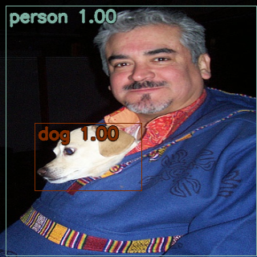

# det-lab



PyTorch 기반 Object Detection 모델 구조 및 학습 기법을 테스트하기 위한 프로젝트입니다.

## Implementations

- RetinaNet
- FrostNet
- Focal Loss
- Muti GPU Training
- Data Augmentations
- mAP Calculation
- Cosine Annealing Warmup Restart L.R. Scheduler
-

## 프로젝트 구조

```
det_lab
├─ .gitignore
├─ __README.md
├─ configs # 학습 시 사용할 하이퍼 파라미터, 데이터셋 설정 등 Configuration을 위한 yaml 파일 경로
├─ dataset # Image Data Generator 모듈
├─ models # Classifier 및 Detector, Convolution Module 등 구현
│  ├─ backbone
│  ├─ detector
│  └─ layers
├─ module # 학습을 위한 Pytorch Lightning 모듈
├─ train_classifier.py # Classifier 학습 스크립트
├─ train_detector.py # Detector 학습 스크립트
└─ utils

```

## Requirements

`pytorch >= 1.8.1`  
`albumentations`  
`PyYaml`  
`Pytorch Lightning`

## Config Train Parameters

기본 설정값은 ./configs/default_settings.yaml에 정의됩니다.  
Train 스크립트 실행 시 입력되는 CFG 파일로 하이퍼파라미터 및 학습 기법을 설정할 수 있습니다.

[default_settings.yaml](./configs/default_settings.yaml)

    // ./configs/*.yaml 파일 수정
    // ex) cls_frostnet -> default_settings 파라미터를 업데이트 해서 사용
    model : 'FrostNet'
    dataset_name : tiny-imagenet
    classes : 200
    epochs: 1000
    data_path : '/host_dir/fssv1/tiny_imagenet-200/'
    save_dir : './saved'
    workers: 16
    ...

## Train Backbone

Backbone 모델을 Classifier로 Pre-train 시키기 위한 스크립트 입니다.

    python train_classifier.py --cfg configs/cls_frostnet.yaml

## Train detector

Object Detector 모델 Train 스크립트 입니다.

    python train_detector.py --cfg configs/det_frostnet.yaml

## Test detector

학습된 Object Detector로 inference test를 하기 위한 스크립트 입니다.

    python .\test_detector.py --cfg .\configs\det_frostnet.yaml --save

## Evalulate

학습된 Object Detector의 mAP를 평가하는 스크립트 입니다.

    TBD

## Reference

- [FrostNet: Towards Quantization-Aware Network Architecture Search-CLOVA AI](https://arxiv.org/abs/2006.09679)
  - [Official Github](https://github.com/clovaai/frostnet#pretrained)
- [Focal Loss for Dense Object Detection](https://arxiv.org/abs/1708.02002)
  - [pytorch-retinanet](https://github.com/yhenon/pytorch-retinanet)

## TODOs

- cIoU 등 추가 Loss 함수 구현
- ATSS, Data Augmentation, LR Scheduler, Optimizer 등 mAP 향상을 위한 tricks 추가
- Deployment를 위한 ONNX Conversion Script, Torch Script 추가
- QAT, Grad Clip, SWA, FP16 등 학습 기법 추가 및 테스트
- Backbone 추가 (MobileNet, EfficientNet, ResNet, RegNet ...)
